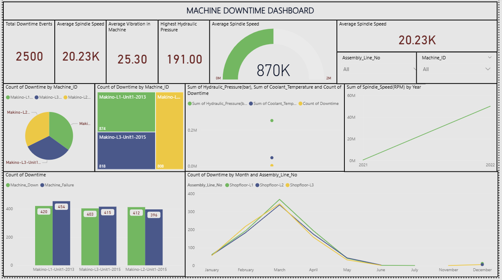

# Machine Downtime Dashboard

## Overview
A **Machine Downtime Monitoring Dashboard** designed to analyze machine performance, downtime events, hydraulic pressure, vibration levels, and spindle speed.

## Key Features
- KPI Metrics:
  - Total Downtime Events
  - Average Spindle Speed
  - Average Vibration
  - Highest Hydraulic Pressure
- Visuals:
  - Downtime Distribution by Machine
  - Downtime by Assembly Line
  - Spindle Speed Trends (Year-wise)
  - Monthly Downtime Trends

## Tools & Technologies
- Power BI
- DAX
- Power Query
- Data Visualization

## Project Structure
```
Machine-Downtime/
│── dataset/
│── dashboard.pbix
│── README.md
```

## Use Cases
- Predictive maintenance
- Machine health monitoring
- Production efficiency analysis
- Manufacturing optimization

---